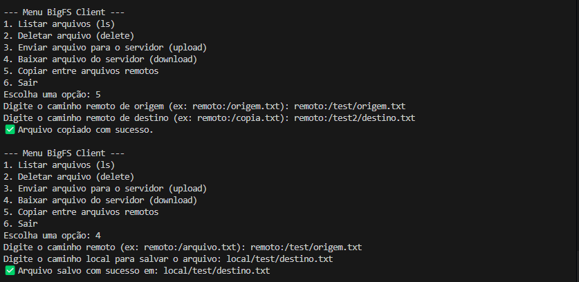
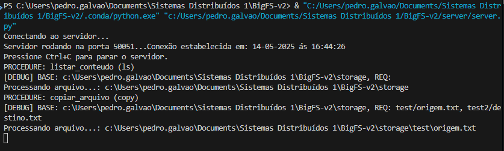

# BigFS - Sistema de Arquivos Distribuído com gRPC

👨‍💻 **Autor:** Pedro Ferreira Galvão Neto — Projeto acadêmico para a disciplina Sistemas Distribuídos I

BigFS é uma implementação educacional de um sistema **NFS (Network File System)** usando a arquitetura cliente-servidor com gRPC em Python.

O projeto permite operações remotas como listar, copiar, deletar, enviar e baixar arquivos entre clientes e um servidor central que exporta um diretório local.

---

## 📁 Estrutura do Projeto
    BigFS-v2/
    ├── client/ # Cliente interativo gRPC
    │ └── client.py
    ├── server/ # Servidor NFS
    │ ├── server.py
    │ └── file_manager.py
    ├── proto/ # Definições .proto e gerados
    │ └── filesystem.proto
    ├── storage/ # Diretório compartilhado exportado pelo servidor
    ├── local/ # Pasta opcional para testes locais
    ├── requirements.txt
    └── README.md

---

## ⚙️ Requisitos

    - Python 3.10+
    - `grpcio`
    - `grpcio-tools`

    Instale com:

        pip install -r requirements.txt

### 📦 Geração dos arquivos gRPC

    python -m grpc_tools.protoc -I. --python_out=. --grpc_python_out=. proto/filesystem.proto

### 🚀 Como executar

1. Iniciar o servidor:
    ```bash
    python server.py

2. Executar o cliente:
    ```bash
    python client.py

### 🧭 Funcionalidades disponíveis
O cliente oferece um menu interativo com as seguintes opções:

1. Listar arquivos remotos
    ```bash
    ls remoto:/subpasta

2. Deletar arquivo remoto
    ```bash
    delete remoto:/arquivo.txt

3. Enviar arquivo local para o servidor (upload)
    ```bash
    copy local.txt remoto:/subpasta/destino.txt

4. Baixar arquivo remoto para local (download)
    ```bash
    copy remoto:/arquivo.txt local.txt

5. Copiar arquivo remoto para outro local remoto
    ```bash
    copy remoto:/arquivo1.txt remoto:/copia_arquivo1.txt

### 🔒 Segurança
*Todos os caminhos são restritos ao diretório storage/.

*Qualquer tentativa de acessar fora do escopo resulta em erro.

*Uploads e downloads suportam qualquer tipo de arquivo via bytes.

### 🧪 Exemplos práticos
1. **Upload**
    Crie arquivos_local/exemplo.txt. Use a opção 3 no menu e envie como: 
    ```bash
    arquivos_local/exemplo.txt → remoto:/exemplo.txt

2. **Download**
    Escolha a opção 4 no menu:
    ```bash
    remoto:/exemplo.txt → arquivos_local/copia.txt

3. **Cópia remota**
    Com o arquivo remoto:/exemplo.txt já no servidor:
    ```bash
    copy remoto:/exemplo.txt remoto:/backup/exemplo_bkp.txt

### 📜 Arquitetura gRPC
    O serviço FileSystemService define os seguintes métodos:
    ```bash
    service FileSystemService {
    rpc Listar (CaminhoRequest) returns (ConteudoResponse);
    rpc Deletar (CaminhoRequest) returns (OperacaoResponse);
    rpc Upload (FileUploadRequest) returns (OperacaoResponse);
    rpc Download (CaminhoRequest) returns (FileDownloadResponse);
    rpc CopiarInterno (CopyRequest) returns (OperacaoResponse);
    }

## Print de Execução:

### Cliente


### Servidor
